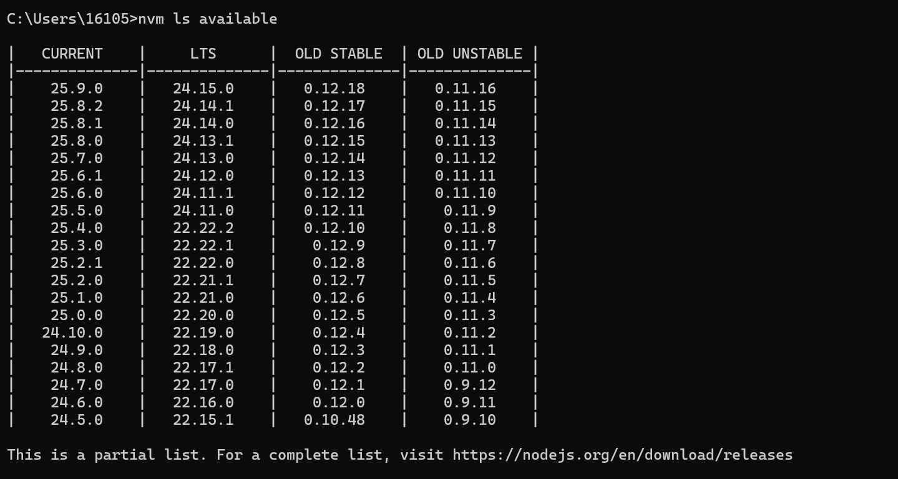

# node 安装

## 安装nvm（node版本控制工具）

```shell
nvm ls available # 查看可以使用的node版本，推荐使用最新的LTS版本，如下图
nvm install {LTS_version}# 安装node版本
nvm use {LTS_version}# 使用LTS
nvm current # 显示当前版本号
```



## 安装`nrm`

`nrm`是镜像源切换工具。

安装`nrm`

```shell
npm install -g nrm --verbose# 安装nrm
```

查看镜像源

```
nrm ls # 查看可用的镜像源
```

使用

```shell
nrm use ${your_registy}
# 如
nrm use huawei
```

## 安装`opencode`

```shell
npm install -g opencode-ai --verbose
```

